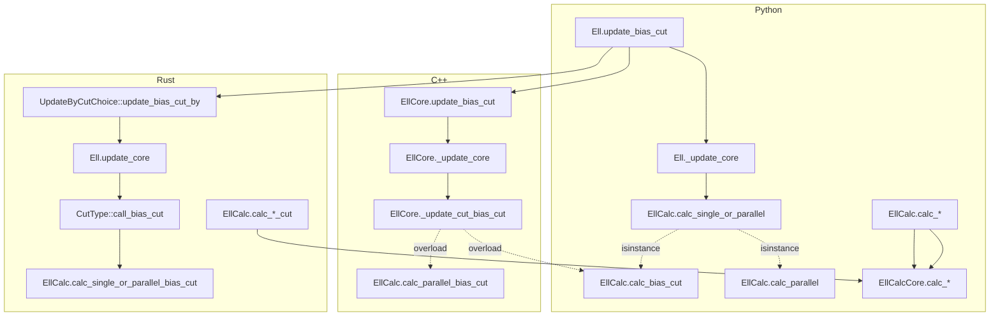

# Ellipsoid Algorithm: Polyglot Implementation Comparison

> Python (`ellalgo`), C++ (`ellalgo-cpp`), Rust (`ellalgo-rs`)

## 1. Project Overview

All three projects implement Khachiyan's ellipsoid method for convex optimization, with
extensions for parallel cuts and discrete (quantized) optimization, and a numerically
stable LDLᵀ variant. They share the same mathematical core but differ in language idioms,
type systems, and numerical safety guards.

| Aspect | Python | C++ | Rust |
|---|---|---|---|
| **Repository** | `github.com/luk036/ellalgo` | `github.com/luk036/ellalgo-cpp` | `github.com/luk036/ellalgo-rs` |
| **Package** | `ellalgo` (PyPI) | `EllAlgo` (CMake) | `ellalgo-rs` (crates.io) |
| **Version** | — | — | `0.1.7` |
| **std/no-std** | N/A | N/A | Feature-gated |
| **Tests** | 113 (C++) | ~100+ (doctest) | 166 |

---

## 2. Architecture & Type System

### 2.1 Array / Matrix Types

| Language | Vector type | Matrix type | Dependencies |
|---|---|---|---|
| **Python** | `numpy.ndarray` | `numpy.ndarray` | `numpy` (external) |
| **C++** | `std::valarray<double>` | Custom `Matrix` (`std::vector<double>`, row-major) | None |
| **Rust** | Custom `Arr` (`Vec<f64>`, 1D/2D dual) | Same `Arr` (cols > 0 = matrix) | None |

**Key insight**: Python relies on numpy's BLAS-optimized operations. C++ and Rust both
use custom flat-vector matrix types with hand-written loops, making them more portable
but potentially slower for large dimensions.

Rust's `Arr` doubles as both vector and matrix using a `cols` field:
- `cols == 0` → 1D vector of length `rows`
- `cols > 0` → 2D row-major matrix with `rows × cols` elements

### 2.2 Cut Type Representation

| Language | Single cut | Parallel cut | Dispatch |
|---|---|---|---|
| **Python** | `float` | `List[float]` / `Tuple[float, Optional[float]]` | `isinstance(beta, (int, float))` |
| **C++** | `double` | `std::valarray<double>` (size ≥ 2) | Template overload: `double` vs `valarray` |
| **Rust** | `SingleCut(f64)` | `ParallelCut(f64, Option<f64>)` | `CutType` trait |

Rust's newtype wrappers give the strongest type safety — `SingleCut` and `ParallelCut`
are distinct types that cannot be confused at compile time.

### 2.3 Interface / Abstraction

| Aspect | Python | C++ | Rust |
|---|---|---|---|
| **Search space contract** | `SearchSpace` ABC with `@abstractmethod` | C++20 `concept SearchSpace<S>` | `SearchSpace` trait |
| **Oracle contract** | `OracleFeas`, `OracleOptim`, `OracleOptimQ` ABCs | Concepts: `OracleFeas<O,A>`, etc. | Traits: `OracleFeas<A>`, `OracleOptim<A>`, etc. |
| **Cut choice dispatch** | `UpdateByCutChoice` in `ell.py` (runtime) | Overloaded `_update_cut_*` in `EllCore` (compile-time) | `UpdateByCutChoice` trait + `CutType` trait |
| **Cut result** | `Tuple[CutStatus, Optional[Tuple[f64,f64,f64]]]` | `CutResult` POD struct | `(CutStatus, (f64, f64, f64))` tuple |

### 2.4 Error / Sentinel Handling

| Language | "No solution found" | Structured errors |
|---|---|---|
| **Python** | `Optional[ArrayType]` → `None` | ❌ |
| **C++** | `invalid_value<T>()` → `NaN` for floats | ❌ |
| **Rust** | `Option<ArrayType>` → `None` | ✅ `EllipsoidError` enum + `EllipsoidResult<T>` |

Rust is the only implementation with a proper error type hierarchy
(`NonConvergence`, `Infeasible`, `NumericalInstability`, etc.).

---

## 3. Core Update Algorithm (`update_core`)

### 3.1 Mathematical Basis

All three implement the same rank-1 update:

```
g̃ = M·g           (matrix-vector product)
ω = g·g̃           (dot product)
τ² = κ · ω        (squared radius)
ρ, σ, δ ← strategy(beta, τ²)
xc ← xc − (ρ/ω)·g̃
M  ← M − (σ/ω)·g̃·g̃ᵀ   (rank-1 update)
κ  ← κ · δ
```

### 3.2 Implementation Comparison

```python
# Python (ell.py:234-270)
grad_t = self._mq @ grad           # numpy mat-vec
omega = grad.dot(grad_t)
if not (omega > np.finfo(float).tiny):   # ← denormal guard
    return CutStatus.NoEffect
self._tsq = self._kappa * omega
# center update done here
self._xc -= (rho / omega) * grad_t
self._mq -= (sigma / omega) * np.outer(grad_t, grad_t)  # numpy rank-1
```

```cpp
// C++ (ell_core.hpp:281-322)
grad_t[i] += this->_mq(i, j) * grad[j];  // explicit double loop
const auto omega = (grad_t * grad).sum();
if (omega <= std::numeric_limits<double>::min()) {  // ← denormal guard
    return CutStatus::NoEffect;
}
// center displacement returned through grad parameter
// explicit symmetric rank-1 with mq(j,i) = mq(i,j)
```

```rust
// Rust (ell.rs:107-147)
let grad_t = self.mq.dot_mv(grad);   // custom mat-vec
let omega = grad.dot(&grad_t);
if omega <= f64::MIN_POSITIVE {        // ← denormal guard
    return CutStatus::NoEffect;
}
self.tsq = self.kappa * omega;
// center update done here
self.xc[i] -= rho_over_omega * grad_t[i];
// explicit rank-1 with symmetry preservation
```

### 3.3 Numerical Robustness — Historical Divergence

Until the patches applied in this session, the three implementations differed in their
omega guards:

| Implementation | omega == 0 | denormal omega | Status |
|---|---|---|---|
| **Python** (original) | `NoEffect` | `NoEffect` (`> tiny`) | ✅ Reference |
| **C++** (original) | `Success` (bug) | ❌ No guard | ❌ |
| **C++** (patched) | `NoEffect` | `NoEffect` (`<= min()`) | ✅ Fixed |
| **Rust** (original) | ❌ No guard (→ NaN/Inf) | ❌ No guard | ❌ |
| **Rust** (patched) | `NoEffect` | `NoEffect` (`<= MIN_POSITIVE`) | ✅ Fixed |

The original C++ returned `CutStatus::Success` with zero displacement for omega=0, which
was semantically wrong (the ellipsoid was not updated). The original Rust had no guard at
all, so `rho / 0.0` and `sigma / 0.0` would produce ±inf/NaN silently.

### 3.4 Rank-1 Update Symmetry Preservation

| Language | Technique |
|---|---|
| **Python** | Implicit via `np.outer(grad_t, grad_t)` |
| **C++** | Explicit `mq(j,i) = mq(i,j)` after each lower-triangular update |
| **Rust** | Explicit `self.mq.data_mut()[j*n+i] = self.mq.data()[idx]` after each update |

C++ and Rust both use the same explicit symmetry-preserving pattern because they
store the full symmetric matrix (unlike Python's numpy which handles this internally).

---

## 4. Numerically Stable LDLᵀ Variant

All three implement the stable form using LDLᵀ factorization (Gill, Murray, Wright,
*Practical Optimization*, p43).

### 4.1 Scratch Buffer Strategy

| Language | Temporary allocations | Pre-allocated buffers |
|---|---|---|
| **Python** | Allocates `inv_lower_g`, `inv_diag_inv_lower_g`, `g_t` each call | ❌ |
| **C++** | `_scratch` (pre-allocated Vec), `invDinvLg` on stack | Partial |
| **Rust** | `inv_ml_g`, `inv_md_inv_ml_g`, `gg_t`, `g_t` (4 buffers) | ✅ Full |

Rust pre-allocates all four scratch buffers in the struct to eliminate per-call
allocations. Python allocates fresh arrays each call. C++ uses a mix.

### 4.2 LDLᵀ Rank-1 Update

The core update loop is algorithmically identical in all three:

```
mu = sigma / (1 - sigma)
oldt = omega / mu
for j in 0..n:
    p = v[j]
    temp = D⁻¹·L⁻¹·g[j]
    newt = oldt + p * temp
    beta2 = temp / newt
    D[j] *= oldt / newt
    for k in j+1..n:
        update L factors
    oldt = newt
```

**Subtle Rust difference**: The Rust `EllStable` stores the LDLᵀ factors differently
during the update. It reads from the lower triangle (`self.mq.at(l, j)`) and writes to
the upper triangle row (`row_start_j + l`), while Python and C++ read from the upper
triangle. Since the matrix is symmetric, this is equivalent.

---

## 5. Cut Calculation Strategies

### 5.1 Core Math Formulas (`EllCalcCore`)

All formulas are algebraically identical. Minor implementation variations:

#### Central cut: δ

| Language | δ |
|---|---|
| Python | `cst1 (= n²/(n²-1))` |
| C++ | `_cst1` |
| Rust | `self.cst1` |

#### Bias (deep) cut: δ

| Language | δ expression |
|---|---|
| Python | `cst1 * (1.0 - alpha) * (1.0 + alpha)` where α = β/τ |
| C++ | `_cst1 * (1.0 - (beta*beta) / (tau*tau))` |
| Rust | `self.cst1 * (1.0 - alpha * alpha)` |

#### Bias cut: σ

| Language | σ expression |
|---|---|
| Python | `cst2 * eta / (tau + beta)` |
| C++ | `_cst2 * eta / (tau + beta)` |
| Rust | `2.0 * rho / (tau + beta)` (⚠️ different formulation, same result) |

Rust computes `sigma = 2 * rho / (tau + beta)` instead of `sigma = cst2 * eta / (tau + beta)`.
Since `rho = eta / (n+1)` and `cst2 = 2/(n+1)`, these are algebraically equivalent, but
Rust uses two divisions instead of one.

### 5.2 Parallel Bias Cut ("Fast" Variant)

All three use the same `ζ₀, ζ₁, ξ` formulation:

```
ζ₀ = τ² − β₀²
ζ₁ = τ² − β₁²
ξ = √(ζ₀·ζ₁ + (½n·(β₁²−β₀²))²)
σ = 2η / (τ² + β₀β₁ + ½n·(β₀+β₁)² + ξ)
ρ = σ·(β₀+β₁) / 2
δ = cst1·((ζ₀+ζ₁)/2 + ξ/n) / τ²
```

The code is near-verbatim across all three:

```python
# Python (ell_calc_core.py:477-487)
sigma = 2.0 * eta / (tsq + b0b1 + self._half_n * bsumsq + xi)
rho = sigma * (beta0 + beta1) / 2.0
delta = self._cst1 * ((zeta0 + zeta1) / 2.0 + xi / self._n_f) / tsq
```

```cpp
// C++ (ell_calc_core.cpp:54-57)
const double sigma = 2.0 * eta / (tsq + b0b1 + this->_half_n * bsumsq + xi);
const double rho = sigma * (beta0 + beta1) / 2.0;
const double delta = this->_cst1 * ((zeta0 + zeta1) / 2.0 + xi / this->_n_f) / tsq;
```

```rust
// Rust (ell_calc.rs:235-237)
let sigma = 2.0 * eta / (tsq + b0b1 + self.half_n * bsumsq + xi);
let rho = sigma * (beta0 + beta1) / 2.0;
let delta = self.cst1 * ((zeta0 + zeta1) / 2.0 + xi / self.n_f) / tsq;
```

### 5.3 Variant Proliferation

| Variant | Python | C++ | Rust |
|---|---|---|---|
| `calc_parallel_bias_cut_fast` (ζ-formula) | ✅ | ✅ (`calc_parallel_cut_fast`) | ✅ |
| `calc_parallel_bias_cut_fast_old` (bavg/k-formula) | ✅ | ✅ (`calc_parallel_cut_fast_old`) | ✅ |
| `calc_parallel_bias_cut_fast2` (alt σ) | ✅ | ❌ | ❌ |
| `calc_parallel_bias_cut_old` (full expanded) | ✅ | ❌ | ❌ |

Python has the most variants (4), C++ and Rust have 2 each. The "fast" ζ-formula is the
canonical implementation in all three.

### 5.4 Cut Dispatch Architecture



- **Python**: Runtime `isinstance` dispatch with 3 dispatcher methods
- **C++**: Compile-time overload resolution via the EllCore `_update_cut_*` overloads
- **Rust**: Trait-based dispatch via `CutType` (strategy pattern)

---

## 6. Discrete (Q) Optimization Guards

### 6.1 `calc_bias_cut_q` — eta check

| Language | Condition | Behavior when eta == 0 |
|---|---|---|
| **Python** | `eta <= 0.0` → `NoEffect` | Correctly rejected |
| **C++** | `eta <= 0.0` → `NoEffect` (with `ELL_UNLIKELY`) | Correctly rejected |
| **Rust** (original) | `eta < 0.0` ❌ | Silently applied zero-effect cut |
| **Rust** (patched) | `eta <= 0.0` ✅ | Correctly rejected |

### 6.2 `calc_parallel_q` — fallback conditions

| Language | Fallback to single cut |
|---|---|
| **Python** | `beta1 > 0.0 and tsq <= b1sq` |
| **C++** | `beta1 > 0.0 && tsq <= beta1*beta1` |
| **Rust** | `beta1 > 0.0 && beta1*beta1 >= tsq` |

All equivalent — only the comparison ordering differs.

### 6.3 `calc_parallel_q` — `eta <= 0.0` guard

All three use `eta <= 0.0 → NoEffect` consistently for the parallel Q variant
(no bug in any language for this path).

---

## 7. Cutting Plane Algorithms

### 7.1 Algorithm Structure

All four algorithm entry points exist in all three languages with identical logic:

| Algorithm | Python | C++ | Rust |
|---|---|---|---|
| `cutting_plane_feas` | ✅ | ✅ | ✅ |
| `cutting_plane_optim` | ✅ | ✅ | ✅ |
| `cutting_plane_optim_q` | ✅ | ✅ | ✅ |
| `bsearch` | ✅ | ✅ | ✅ |
| `BSearchAdaptor` | ✅ | ✅ | ✅ |

### 7.2 `bsearch` — Interval halving

| Language | Halving method |
|---|---|
| **Python** | `tau = (upper - lower) / 2` |
| **C++** | `tau = algo::half_nonnegative(upper - lower)` |
| **Rust** | `tau = (upper - lower) / 2.0` |

C++ uses `half_nonnegative()` which guards against subnormal underflow for tiny
intervals. Python and Rust use direct division.

### 7.3 `bsearch` — Return convention

| Language | Solution found | Not found |
|---|---|---|
| **Python** | `(upper, niter)` | `(upper, max_iters)` |
| **C++** | `{upper, niter}` | `{upper, max_iters}` |
| **Rust** | `(upper != u_orig, niter)` | `(upper != u_orig, max_iters)` |

Rust returns a `(bool, usize)` tuple (`CInfo`) where the boolean indicates whether a
feasible solution was found (detected by whether `upper` changed from its original
value). Python and C++ always return `upper` plus iteration count.

---

## 8. 1D Variant

| Language | Status | API |
|---|---|---|
| **Python** | Type stub only (`ell1d.tpy`) | Not implemented |
| **C++** | Full (`ell1d.hpp` + `ell1d.cpp`) | `update(cut) → CutStatus` |
| **Rust** | Full (`ell1d.rs`) | `update(cut) → (CutStatus, f64)` |

Rust's `Ell1D.update_single` returns an extra `f64` (the `tsq` value) that is not
returned by C++.

Rust's implementation has a unique central-cut optimization:

```rust
if beta == 0.0 {
    self.r /= 2.0;
    self.xc += if grad_val > 0.0 { -self.r } else { self.r };
    return (CutStatus::Success, tsq);
}
```

This halves the radius directly for central cuts, which is a GD-style step specific to 1D.

---

## 9. Additional Components

| Component | Python | C++ | Rust |
|---|---|---|---|
| **Conjugate Gradient** | `conjugate_gradient.py` | `conjugate_gradient.hpp` + `conjugate_gradient2.hpp` | `conjugate_gradient.rs` |
| **Power Iteration** | ❌ | ❌ | `power_iteration.rs` |
| **Logging** | ❌ | `logger.hpp` / `logger.cpp` | `logging.rs` (via `log` crate) |
| **Structured errors** | ❌ | ❌ | `error.rs` |
| **Covariance constructor** | ❌ | ❌ | `Ell::from_covariance()` |
| **`no_defer_trick`** | ✅ | ✅ | ✅ |
| **Theory doc (svgbob)** | ❌ | Doxygen + svgbob | `svgbobdoc` crate + doc-tests |

---

## 10. Numerical Robustness — Complete Matrix

| Guard / Check | Python | C++ (patched) | Rust (patched) |
|---|---|---|---|
| **Zero omega → NoEffect** | ✅ | ✅ | ✅ |
| **Denormal omega → NoEffect** | ✅ (`> tiny`) | ✅ (`<= min()`) | ✅ (`<= MIN_POSITIVE`) |
| **eta ≤ 0 in `calc_bias_cut_q`** | ✅ (`<=`) | ✅ (`<=`) | ✅ (`<=`) |
| **eta ≤ 0 in `calc_parallel_q`** | ✅ (`<=`) | ✅ (`<=`) | ✅ (`<=`) |
| **beta1 < beta0 → NoSoln** | ✅ | ✅ | ✅ |
| **tsq < beta² → NoSoln** | ✅ | ✅ | ✅ |
| **`half_nonnegative` in bsearch** | ❌ | ✅ | ❌ |

The three original gaps in Rust/C++ that have been closed in this session are marked
**(patched)**.

---

## 11. Summary

### Algorithmic Identity

All three implementations compute **identical mathematical results** for the same inputs.
The core formulas for `(ρ, σ, δ)` in all cut types — central, bias (deep), parallel
central, and parallel bias — are the same across all languages.

### Key Implementation Differences

1. **Matrix backend**: numpy (Python) vs custom flat-vector (C++, Rust)
2. **Cut dispatch**: `isinstance` (Python) vs template overload (C++) vs traits (Rust)
3. **Numerical guards**: Python was the most conservative; C++ and Rust both had gaps
4. **Scratch allocation**: Rust pre-allocates; Python allocates per-call; C++ is mixed
5. **Error handling**: Rust has structured error types; Python/C++ use sentinels
6. **`bsearch` halving**: C++ guards against subnormal underflow; Python/Rust don't
7. **1D variant**: C++ and Rust are fully implemented; Python is a stub

### Patches Applied

| Date | File | Change | Rationale |
|---|---|---|---|
| 2026-07-05 | `ell_core.hpp` (C++) | `omega == 0 → NoEffect` + denormal guard | Match Python's `np.finfo(float).tiny` check |
| 2026-07-05 | `ell.rs` (Rust) | Added `omega <= f64::MIN_POSITIVE` guard | Match Python and C++ |
| 2026-07-05 | `ell_stable.rs` (Rust) | Added `omega <= f64::MIN_POSITIVE` guard | Match Python and C++ |
| 2026-07-05 | `ell_calc.rs` (Rust) | `eta < 0.0` → `eta <= 0.0` | Match Python/C++ (`== 0` should also return NoEffect) |
