# Ellipsoid Method and the Amazing Oracles 🎯

## A 60-Minute Technical Presentation

---

# 📑 Agenda

1. **Introduction** - What is the Ellipsoid Method? 🧭
2. **Core Components** - The Search Space (Ellipsoid) 📦
3. **Cutting Plane Algorithms** - The Engine 🔧
4. **The Amazing Oracles** - Problem-Specific Oracles 🔮
5. **Deep Dive: Ellipsoid Updates** - The Math Behind the Magic 🧮
6. **Real-World Applications** - From Finance to Signal Processing 🌐
7. **Summary & Q&A** ❓

---

# 1. Introduction: The Ellipsoid Method 🧭

## What is the Ellipsoid Method?

The **Ellipsoid Method** is a *polynomial-time* algorithm for convex optimization, introduced by **L.G. Khachiyan in 1979**.

> 🎯 It uses ellipsoids to iteratively reduce the feasible region until an optimal solution is found.

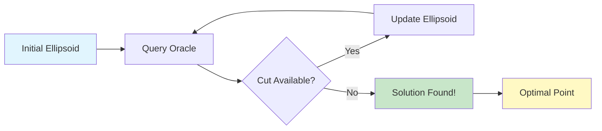

## Key Properties

| Property | Description |
|----------|-------------|
| ⏱️ **Time Complexity** | $O(n^4 L)$ where $L$ is input bits |
| 📊 **Iterations** | Polynomial in problem dimension |
| 🎯 **Optimality** | Guarantees $\epsilon$-optimal solution |
| 🔄 **Robustness** | Works with only subgradient access |

---

# 2. Core Components: The Search Space 📦

## The `Ell` Class

```python
from ellalgo.ell import Ell
import numpy as np

# Create ellipsoid with radius 1.0 centered at origin
ell = Ell(1.0, np.array([0.0, 0.0]))
```

### Visual Representation

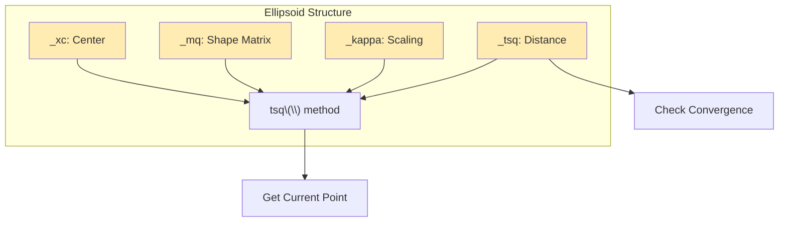

### Ellipsoid Parameters

- **$x_c$**: Center point (current best solution candidate) 📍
- **$M$**: Shape matrix (defines ellipsoid geometry) 🧭
- **$\kappa$**: Scaling factor 🔢
- **$\tau^2$**: Distance measure to optimal point 📏

---

# 3. Cutting Plane Algorithms 🔧

## The Main Algorithm

```python
from ellalgo.cutting_plane import cutting_plane_feas, cutting_plane_optim
from ellalgo.ell_config import Options

# Feasibility problem
x, niter = cutting_plane_feas(oracle, space, Options())

# Optimization problem
x, gamma, niter = cutting_plane_optim(oracle, space, gamma_init, Options())
```

## Algorithm Flow

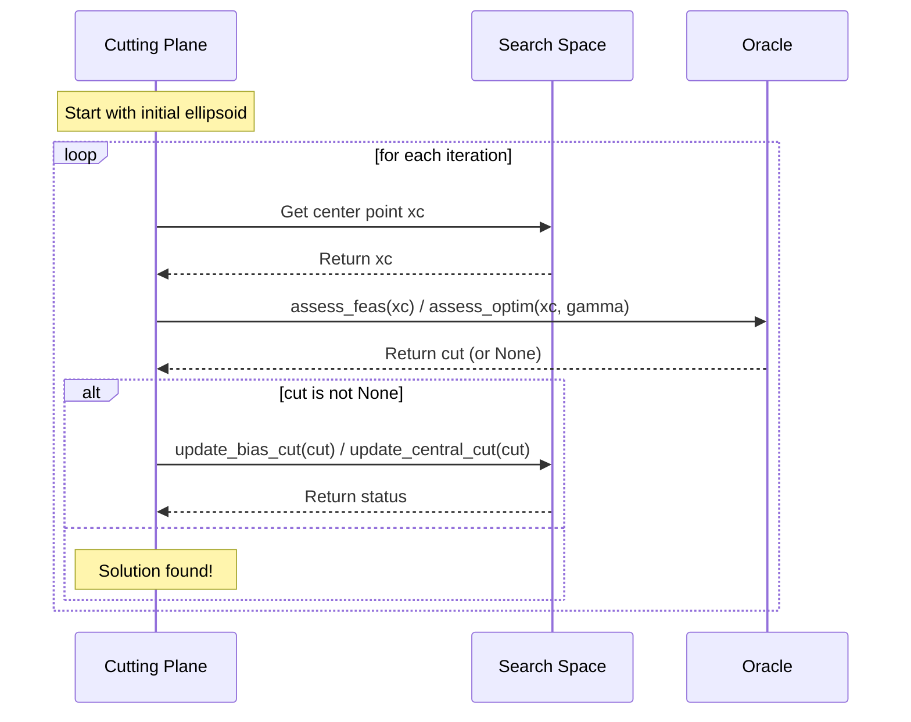

---

# 4. Types of Cuts 🗡️

## Deep Cut (Bias Cut)

```python
# Deep cut - cuts through ellipsoid
ell.update_bias_cut((gradient, beta))
```

The deep cut equation:

$$
g^T(x - x_c) + \beta \leq 0
$$

Where $\beta$ controls cut position (not through center).

## Central Cut

```python
# Central cut - passes through center
ell.update_central_cut((gradient, 0.0))
```

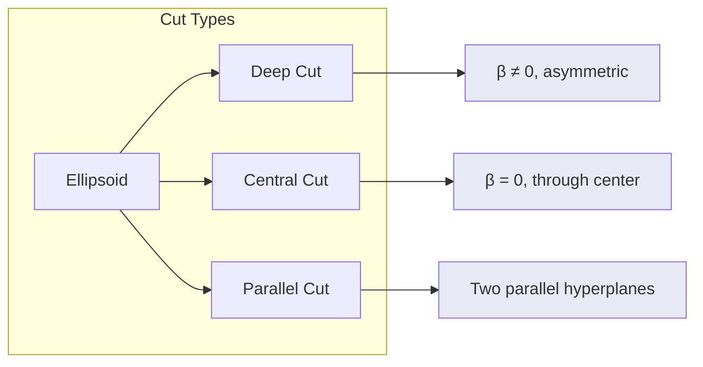

## Parallel Cut

```python
# Parallel cut - two constraints
# Format: (gradient, (beta_lower, beta_upper))
ell.update_bias_cut((gradient, (beta0, beta1)))
```

Useful when you have constraints like:
$$
a^T x \leq b_1 \quad \text{and} \quad -a^T x \leq -b_2
$$

---

# 5. The Amazing Oracles 🔮

## Oracle Interfaces

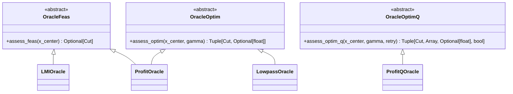

## 5.1 LMI Oracle - Linear Matrix Inequalities 📐

```python
from ellalgo.oracles.lmi_oracle import LMIOracle

# LMI: B - (F1*x1 + F2*x2 + ...) ⪰ 0
oracle = LMIOracle([F1, F2, ..., Fn], B)

cut = oracle.assess_feas(xc)
# Returns (gradient, violation) if infeasible
```

### Mathematical Background

The LMI constraint:

$$
B - \sum_{i=1}^n F_i x_i \succeq 0
$$

Using **LDLT factorization** to check positive semidefiniteness:

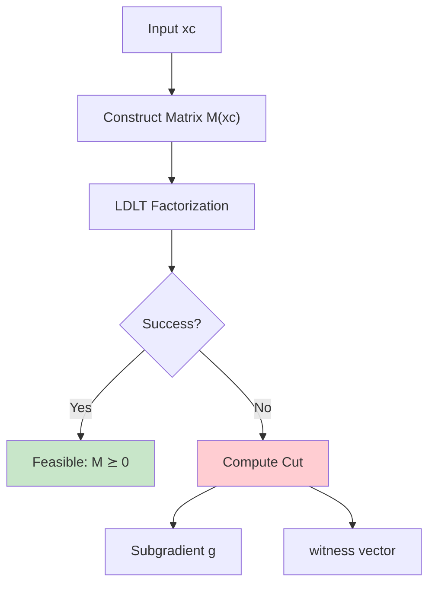

### LDLT Manager

```python
from ellalgo.oracles.ldlt_mgr import LDLTMgr

ldlt_mgr = LDLTMgr(matrix_size)
if ldlt_mgr.factor(get_elem):
    # Matrix is PSD
else:
    witness = ldlt_mgr.witness()
    g = ldlt_mgr.sym_quad(Fk)  # subgradient
```

---

## 5.2 Profit Oracle - Economic Optimization 💰

```python
from ellalgo.oracles.profit_oracle import ProfitOracle

# Cobb-Douglas production function
# max p*A*y1^α*y2^β - v1*y1 - v2*y2
# s.t. y1 ≤ k

oracle = ProfitOracle(
    params=(unit_price, scale, limit),  # (p, A, k)
    elasticities=np.array([α, β]),      # [α, β]
    price_out=np.array([v1, v2])        # [v1, v2]
)
```

### Mathematical Model

**Production Function:**
$$
f(y) = p \cdot A \cdot y_1^\alpha \cdot y_2^\beta
$$

**Profit:**
$$
\pi(y) = p A y_1^\alpha y_2^\beta - v_1 y_1 - v_2 y_2
$$

**Constraint:**
$$
y_1 \leq k
$$

### Solution in Log-Space

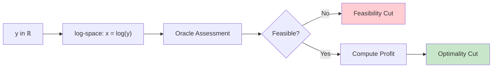

### Variations

```python
# Robust Profit Oracle - handles uncertainty
from ellalgo.oracles.profit_oracle import ProfitRbOracle

oracle_rb = ProfitRbOracle(
    params=(unit_price, scale, limit),
    elasticities=np.array([α, β]),
    price_out=np.array([v1, v2]),
    vparams=(ε1, ε2, ε3, ε4, ε5)  # uncertainty params
)

# Discrete Profit Oracle - integer inputs
from ellalgo.oracles.profit_oracle import ProfitQOracle

oracle_q = ProfitQOracle(params, elasticities, price_out)
# Maximizes profit with y ∈ ℕ²
```

---

## 5.3 Lowpass Oracle - FIR Filter Design 📡

```python
from ellalgo.oracles.lowpass_oracle import LowpassOracle, create_lowpass_case

# Design FIR lowpass filter
oracle = LowpassOracle(
    ndim=48,      # Number of coefficients
    wpass=0.12,   # Passband edge (normalized)
    wstop=0.20,   # Stopband edge
    lp_sq=0.99,   # Lower passband bound (squared)
    up_sq=1.01,   # Upper passband bound (squared)
    sp_sq=0.01    # Stopband bound (squared)
)

# Or use default case
oracle = create_lowpass_case()
```

### Filter Design Problem

**Objective:** Minimize maximum stopband response

$$
\min_x \max_{w \in \text{stopband}} |H(w)|
$$

**Subject to:**
$$
\frac{1}{\delta} \leq |H(w)| \leq \delta \quad \text{for } w \in \text{passband}
$$
$$
|H(w)| \leq \text{stopband bound} \quad \text{for } w \in \text{stopband}
$$

### Spectral Factorization

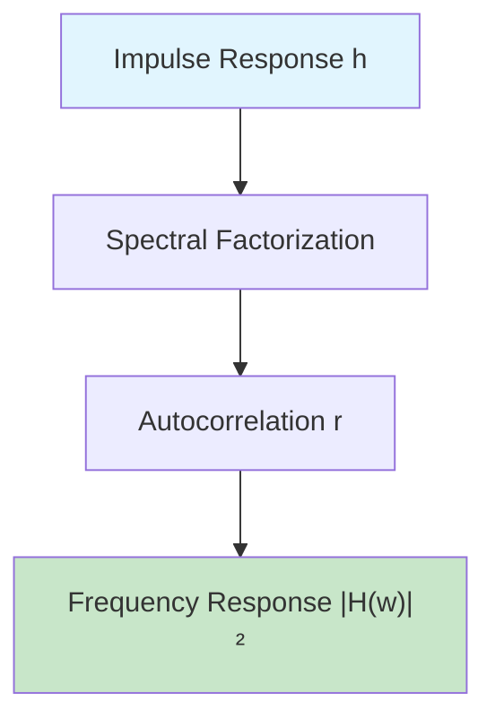

Using **Kolmogorov 1939** method:

```python
from ellalgo.oracles.spectral_fact import spectral_fact

r = np.array([1.0, 0.5, 0.2])  # Autocorrelation
h = spectral_fact(r)  # Minimum-phase impulse response
```

### Constraint Checking

```python
# Passband constraints
if response > upper_bound:
    return gradient, (violation_lower, violation_upper)

# Stopband constraints
if response > stopband_limit:
    return gradient, (stopband_violation, response)
```

---

# 6. Deep Dive: Ellipsoid Updates 🧮

## The Update Formulas

Given a cut $(g, \beta)$:

### Step 1: Compute Key Values

$$
\begin{aligned}
\omega &= g^T M g \\
\rho &= \frac{\kappa \beta + \sqrt{\kappa^2 + \omega (\kappa + \beta)^2}}{\omega + \kappa} \\
\sigma &= \frac{\kappa + \beta}{\kappa + \beta + \rho \omega} \\
\delta &= \frac{\kappa + \beta + \rho \omega}{\kappa (n + 1)}
\end{aligned}
$$

### Step 2: Update Parameters

```python
# In Python (from ell.py)
grad_t = M @ grad              # M * g
omega = grad.dot(grad_t)       # g^T * M * g
rho, sigma, delta = result     # From EllCalc

# Update center
xc_new = xc - (rho / omega) * grad_t

# Update shape matrix
M_new = M - (sigma / omega) * outer(grad_t, grad_t)

# Update scaling
kappa_new = kappa * delta
```

### Visual Interpretation

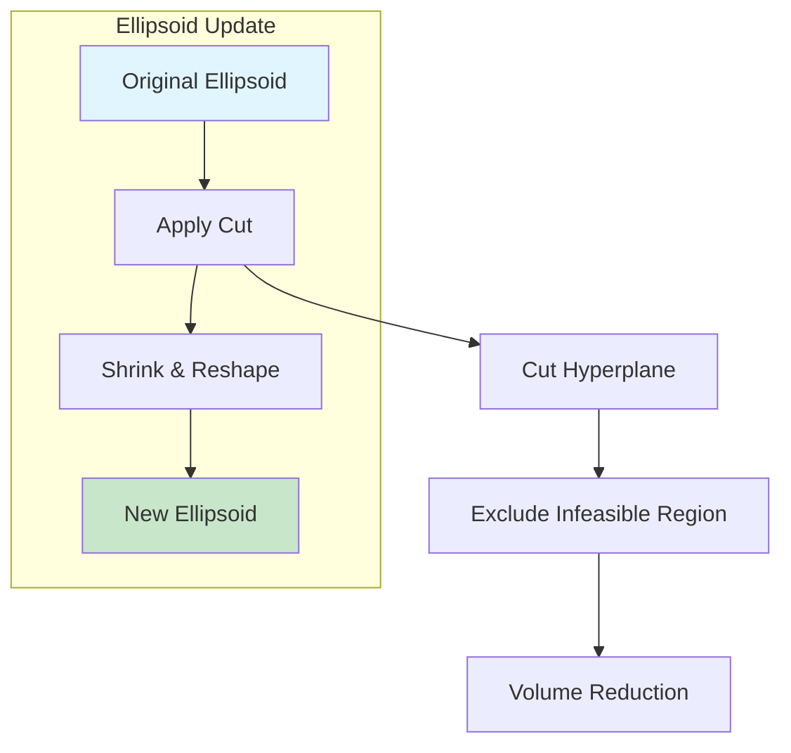

### Volume Reduction Guarantee

The ellipsoid method guarantees at least **$e^{-1/(n+1)}$** volume reduction per iteration!

For $n=10$: $\approx 0.95^{11} \approx 57\%$ reduction

---

# 7. Real-World Applications 🌐

## Application Overview

| Application | Oracle | Problem Type |
|-------------|--------|--------------|
| 📐 Control Systems | LMIOracle | Stability verification |
| 💰 Portfolio Optimization | ProfitOracle | Resource allocation |
| 📡 Signal Processing | LowpassOracle | Filter design |
| 🔬 Robust Optimization | ProfitRbOracle | Uncertainty handling |

## LMI in Control Systems

```python
# Verify: A^T P + P A + Q < 0 has solution P ⪰ 0
# Lyapunov stability condition

F1 = ...  # Coefficients
F2 = ...
B = ...   # Constraint matrix

oracle = LMIOracle([F1, F2], B)
cut = oracle.assess_feas(P)
```

## Filter Design Example

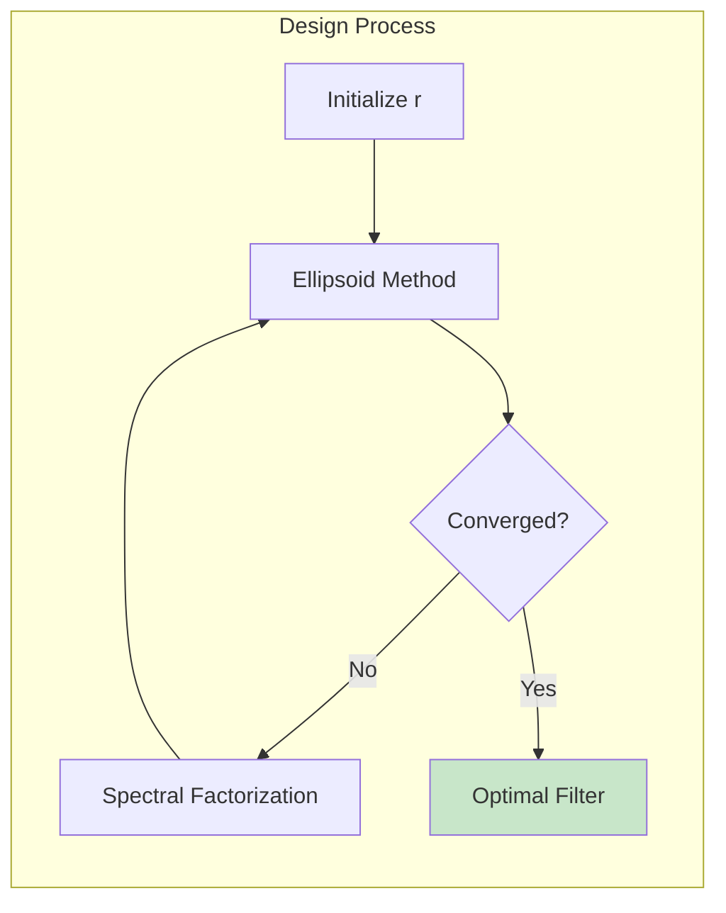

---

# 8. Code Example: Putting It All Together 🛠️

## Complete Example: Filter Design

```python
import numpy as np
from ellalgo.ell import Ell
from ellalgo.cutting_plane import cutting_plane_optim
from ellalgo.ell_config import Options
from ellalgo.oracles.lowpass_oracle import create_lowpass_case

# Create oracle and initial ellipsoid
oracle = create_lowpass_case(48)
x0 = np.zeros(48)
space = Ell(10.0, x0)

# Run optimization
options = Options()
options.max_iters = 2000
options.tolerance = 1e-8

x, gamma, niter = cutting_plane_optim(oracle, space, 0.5, options)

print(f"Iterations: {niter}")
print(f"Stopband attenuation: {gamma:.4f}")
```

---

# 9. Summary 📝

## Key Takeaways

1. 🎯 **Ellipsoid Method**: Polynomial-time algorithm for convex optimization
2. 📦 **Search Space**: Ellipsoid defined by center, shape matrix, and scaling
3. 🗡️ **Cuts**: Deep cuts, central cuts, parallel cuts for different strategies
4. 🔮 **Oracles**: Problem-specific implementations that provide cutting planes
5. 📐 **LMI Oracle**: Linear Matrix Inequalities for control & systems
6. 💰 **Profit Oracle**: Economic optimization with Cobb-Douglas production
7. 📡 **Lowpass Oracle**: FIR filter design via spectral factorization

## Architecture Diagram

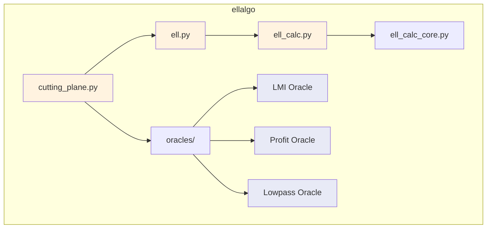

---

# ❓ Questions?

## Resources

- 📚 Documentation: [ellalgo.readthedocs.io](https://ellalgo.readthedocs.io/)
- 💻 Source Code: [github.com/luk036/ellalgo](https://github.com/luk036/ellalgo)
- 📖 Paper: Khachiyan, L.G. (1979) "Polynomial algorithms in linear programming"

---

# Thank You! 🎉

*Made with ❤️ using Python + NumPy*
